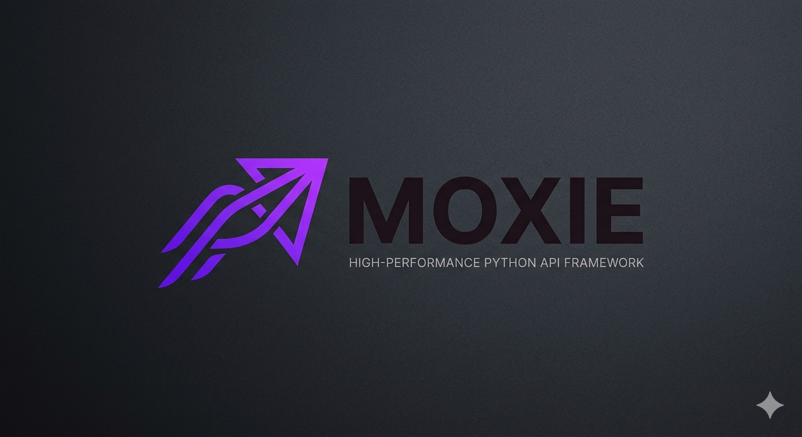

<p align="center">
  
</p>

<h1 align="center">Moxie API</h1>

<p align="center">
  <strong>The blazing-fast, modern Python framework designed for speed, efficiency, and developer productivity.</strong>
</p>

<p align="center">
  
  
  
</p>

---

Moxie is an ASGI-native web framework built on top of high-performance components. It combines the ease of use of FastAPI with a modular architecture that gives you full control over your API's lifecycle.

## ✨ Key Features

- 🚀 **Blazing Fast**: Built on `uvicorn` and optimized `asyncio` for maximum throughput.
- 🛠️ **Dependency Injection**: A robust, built-in DI system that makes testing and modularity a breeze.
- 📜 **Auto OpenAPI**: Stunning, interactive documentation with Swagger UI and ReDoc, generated automatically from your code.
- 🔌 **Plugin System**: Easily extend the framework with custom plugins for health checks, logging, and more.
- 🛡️ **Type Safety**: Full Pydantic integration for request validation and response serialization.
- 🌐 **WebSockets**: Native, easy-to-use WebSocket support with JSON serialization.

## 🚀 Quickstart

Install Moxie using pip:

```bash
pip install moxie-api
```

Create a file named `app.py`:

```python
from moxie import Moxie

app = Moxie(title="My Awesome API")

@app.get("/")
async def root():
    return {"message": "Welcome to Moxie!"}

@app.get("/items/{item_id}")
async def read_item(item_id: int, q: str = None):
    return {"item_id": item_id, "q": q}
```

Run your API:

```bash
moxie dev app:app
```

Now visit `http://127.0.0.1:8000/docs` to see your interactive documentation!

## 🎨 Visual Identity

Moxie is designed to look as good as it performs. Check out our modern landing page design:

<p align="center">
  
</p>

## 🤝 Contributing

We welcome contributions! Please see our [Contributing Guide](CONTRIBUTING.md) for more details.

## 📄 License

Moxie is licensed under the MIT License. See the [LICENSE](LICENSE) file for more information.
